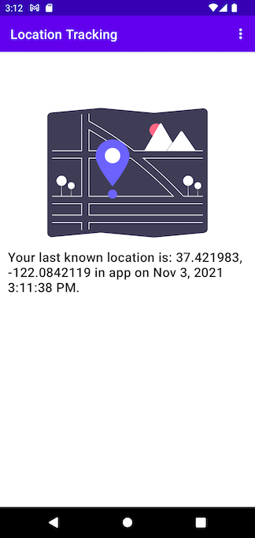

# Location Tracking Example

The question "how do we do location tracking even when the app is in the background?" comes up frequently.
This example application covers how to set up your permissions and using appropriate services to
continuously get location updates.

## Requirements

1. JAVA 11 - Go to Preferences > Build, Execution, Deployment > Build Tools > Gradle > Gradle JDK
2. Android SDK Platform 31
3. Emulator running Android 12

## Description

This application uses the [Fused Location Provider API](https://developers.google.com/location-context/fused-location-provider/)
to get the devices location. By providing a PendingIntent the API will broadcast an Intent every time
a location update is ready, which can be received via a [BroadcastReceiver](https://developer.android.com/guide/components/broadcasts?hl=en#receiving-broadcasts).
Each location update is then stored in a [Room database](https://developer.android.com/training/data-storage/room)
so that we can update the update the UI accordingly.

The app will attempt to [request the necessary permissions](https://developer.android.com/training/permissions/requesting)
each time we start the application, or show an error message to the user. Firstly, we request
[location foreground permissions](https://developer.android.com/training/location/permissions#foreground),
then we request [location background permissions](https://developer.android.com/training/location/permissions#request-background-location)
(aka "Allow all the time").

Android 12 has a greater focus on highlighting how apps are accessing private data, in our case location
updates. A new feature care [Privacy Dashboard](https://developer.android.com/training/permissions/explaining-access#privacy-dashboard-show-rationale)
in the device settings will show when apps are accessing such data. The app provides a rationale screen
which explains why we are collecting location updates, which can be launched from the Privacy Dashboard.

Lastly, we may know what data we are accessing, but we may not know what third-party libraries are
accessing. Using the `AppOpsManager` we can [audit data access](https://developer.android.com/guide/topics/data/audit-access)
and capture/log that information. This doesn't necessarily add anything useful for end users, but
will provide further insights for developers.

## References

- https://developer.android.com/training/location
- https://github.com/android/location-samples/tree/main/LocationUpdatesBackgroundKotlin
- https://developers.google.com/android/reference/com/google/android/gms/location/LocationRequest
- https://developers.google.com/android/reference/com/google/android/gms/location/SettingsClient
- https://issuetracker.google.com/issues/198176818#comment70

## Third-party libraries
(Excluding Android/Google libraries)

- https://github.com/ibrahimsn98/live-preferences - Wrap SharedPreferences with LiveData so that we can observe changes.
- https://undraw.co - Images used in the app.
